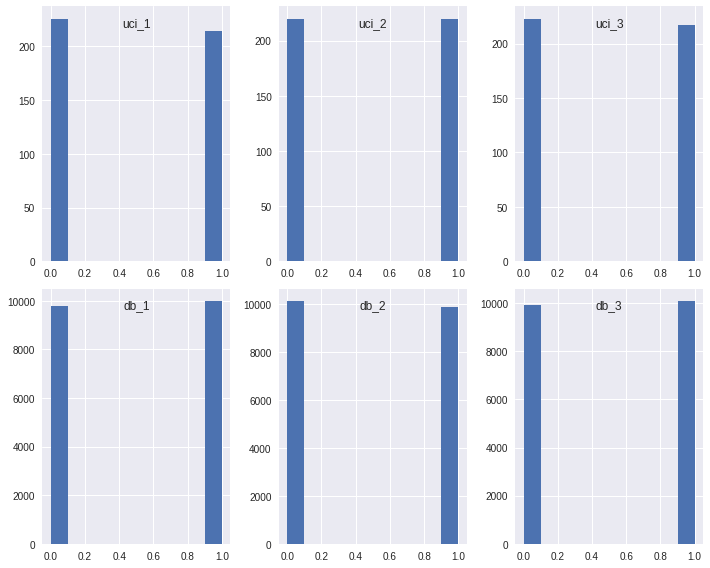
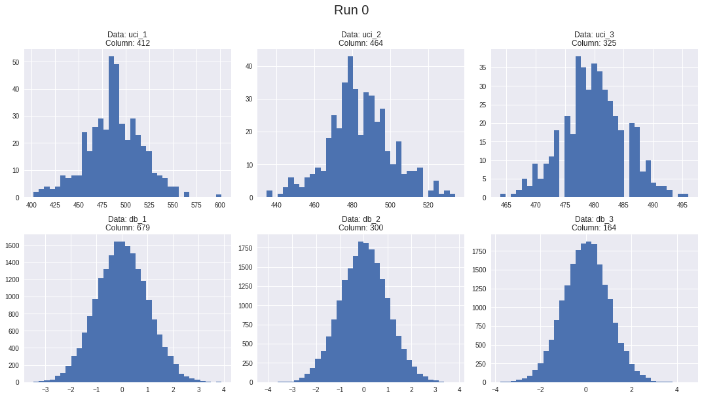
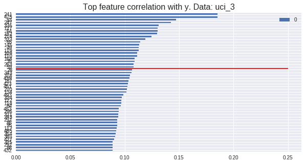
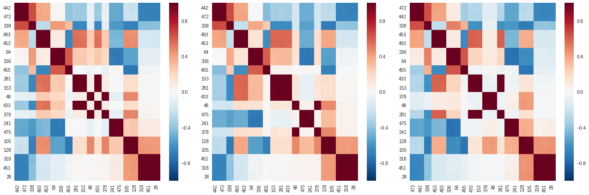
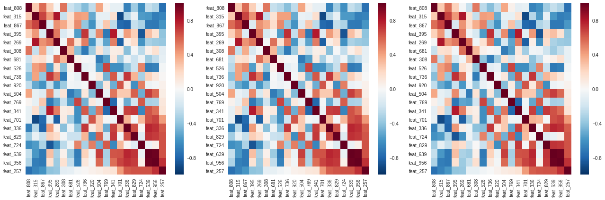

**Problem Statement**

The Madelon data as described by UCI: MADELON is an artificial dataset, which was part of the NIPS 2003 feature selection challenge. This is a two-class classification problem with continuous input variables. The difficulty is that the problem is multivariate and highly non-linear.

The objective is to develop a series of models for two purposes:

1. Identifying relevant features.
1. Generating predictions from the model.
    * Models will be scored on Accuracy, as this is a conventional metric for classification problem. 

Agenda:
1. Exploratory Data Analysis
1. Benchmarking
1. Feature Selection
1. Secondary EDA
1. Model Pipeline Development
1. Final Model Execution

[Github Repository](https://git.generalassemb.ly/dannyboyjohnston/project_3)

\pagebreak

## 1. EDA

I have 6 different datasets for this project.
* 3 samples of the UCI sourced data, each with 440 rows and 500 features. These are labeled `uci_1`, `uci_2`, and `uci_3`
* 3 samples of the database sourced data, each with ~20000 rows and 1000 features. These are labeled `db_1`, `db_2`, and `db_3`
    * Sample size varies based on the `TABLESAMPLE` arguement in `postgresql`
    
Taking a look at the data 
1. Distribution of target
1. A sample of feature distributions
1. A sample of correlations between features and target

The complete output of charts and relevant code can be found in [0_EDA.ipynb](https://git.generalassemb.ly/dannyboyjohnston/project_3/blob/master/0_EDA.ipynb)

### 1.1 Distribution of target

It appears that the target is uniformly distributed across all samples of both data sources.



\pagebreak

### 1.2 Distribution of features

Here are an assortment of histograms describing features across the samples and data sources. The DB data appears to be normal, but the UCI data appears to be more noisy. The histograms aren't conclusive, but they may indicate multimodal distributions. 



\pagebreak

### 1.3 Feature Correlation to target

To see if the informative features could be easily identified I correlated the features with the target. While it appears that some features might be easily identified, the difference is much less clear around the 20th top ranked feature. 



\pagebreak

## 2. Benchmarking

In order to help assess the value of our work, it is important to give ourselves some baseline prediction scores. As I observed during our EDA, the target distribution is functionally uniform, i.e. 50/50. 

Before I spend too much time in feature selection and engineering, I want to test a few different models. These models are naive (using the default settings.) These naive models are generally used to help determine if our model tuning is helping or hurting. There is also a chance that a naive model will be very successful; from the description of the data as well as our EDA I doubt that this will be the case.

To avoid overfitting, I have set the regularisation parameter to large value: `C = 10 ** 9`

The complete output and relevant code can be found in [1_Benchmarking.ipynb](https://git.generalassemb.ly/dannyboyjohnston/project_3/blob/master/1_Benchmarking.ipynb)

### 2.1 Benchmarking Results

The resulting accuracy scores  of the benchmark models for each of the samples are outlined below. They are often no better than flipping a coin.

**UCI samples**
* Logistic Regression: 0.466462, 0.552273, 0.522887
* Decision Tree: 0.517785, 0.597727, 0.504547
* K Nearest Neighbors:  0.545793, 0.552273, 0.544284
* Support Vector Classification: 0.509298, 0.584091, 0.581951

**Database samples**
* Logistic Regression: 0.527293, 0.529960, 0.531837
* Decision Tree: 0.612137, 0.600156, 0.597360
* K Nearest Neighbors: 0.541417, 0.549934, 0.528786
* Support Vector Classification: 0.543935, 0.544123, 0.562589

\pagebreak

## 3. Feature Selection

Given the EDA and the nature of the data, feature selection will be one of the most important steps we take during this project. For the UCI data, I know that there are 20 informative features that we need to identify, with 5 being true predictors and 15 being redundant linear combinations of the 5 true features. I am unsure how many informative features there are in the Madelon data, but that it should follow a similar structure of some true predictors and some redundant linear combinations. 

This last point is important; I **know** that the informative features are at least partially related to each other. This will be key in identifying the informative features.

Three different techniques were used in trying to identify the informative features with varying levels of success:
1. Target prediction with individual features
2. Feature prediction with other features
3. Feature correlations

The complete notes and relevant code can be found in the following notebooks:

* [2_Feature_Extraction_Iterative_Model_A.ipynb](https://git.generalassemb.ly/dannyboyjohnston/project_3/blob/master/2_Feature_Extraction_Iterative_Model_A.ipynb)
* [2_Feature_Extraction_Iterative_Model_B.ipynb](https://git.generalassemb.ly/dannyboyjohnston/project_3/blob/master/2_Feature_Extraction_Iterative_Model_B.ipynb)
* [2_Feature_Extraction_Classification_and_Correlation.ipynb](https://git.generalassemb.ly/dannyboyjohnston/project_3/blob/master/2_Feature_Extraction_Classification_and_Correlation.ipynb)

\pagebreak

### 3-1. Target prediction with individual features

I attempted to discern feature importance by fitting models of each individual feature against the target. The following naive models were used:

* `DecisionTreeClassifier()`
* `KNeighborsClassifier()`
* `LogisticRegression()`

The results of this approach were inconsistent accross datasets and ultimately unreliable. I somewhat expected that this would be the case given the distributions of feature correlations with the target. The results from this approach will not be further discussed.

### 3-2. UCI Feature prediction with other features

As previously mentioned, I **know** that the informative features are largely related to eachother. The original true predictors are independent, but were then used to create linear combinations. This means I can test to see how well features can be predicted by other features to identify those that are most highly related.

I used `DecisionTreeRegressor` to test the relationships between variables.

As we can see, there is a very noticible drop in $R^{2}$ scores after the 20th feature. Scores go from positive to negative! Furthermore, all samples of the UCI data returned consistent results, adding confidence that we have identified the 20 informative features.

|UCI Feature|R2|
|---|---|
|64|0.958868|
|336|0.956095|
|451|0.953310|
|28|0.952888|
|128|0.950895|
|318|0.948276|
|281|0.945870|
|433|0.943008|
|105|0.941654|
|453|0.940853|
|472|0.940290|
|48|0.938026|
|475|0.937661|
|153|0.936956|
|378|0.935737|
|442|0.934861|
|493|0.933505|
|241|0.931829|
|338|0.674691|
|455|0.599619|
|11	|-0.810011|
|52	|-0.810362|
|34	|-0.810780|
|85	|-0.824573|
|29	|-0.848329|

Using the same approach, I notice that the same drop in $R^{2}$ scores occurs at after the 20th feature. With this, I can identify 20 features from the Database samples. 

|Feature|R2|
|---|---|
|feat_639|0.956720|
|feat_956|0.953808|
|feat_269|0.908935|
|feat_867|0.902803|
|feat_395|0.890928|
|feat_341|0.890568|
|feat_315|0.877562|
|feat_701|0.865676|
|feat_736|0.854405|
|feat_336|0.852760|
|feat_724|0.845802|
|feat_920|0.832407|
|feat_257|0.820792|
|feat_769|0.803359|
|feat_308|0.798796|
|feat_829|0.797168|
|feat_504|0.781253|
|feat_808|0.776515|
|feat_526|0.757537|
|feat_681|0.739815|
|feat_535|-0.633511|
|feat_795|-0.635518|
|feat_764|-0.687781|
|feat_452|-0.699119|
|feat_649|-0.700631|

Great success again.

In summary:
Each sample of UCI data suggests that the same 20 features are related, giving us high confidence that the following features are predictors of the target: 

`[28,  48,  64, 105, 128, 153, 241, 281, 318, 336, 338, 378, 433, 442, 451, 453, 455, 472, 475, 493]`

Each sample of Madelon DB data suggests that the same 20 features are related, giving us high confidence that the following features are predictors of the target: 

`[257, 269, 308, 315, 336, 341, 395, 504, 526, 639, 681, 701, 724, 736, 769, 808, 829, 867, 920, 956]`

While this approach appears to provide conclusive results, took a considerable amount of time to fit all of the necessary model. The next approach explores a faster alternative.

\pagebreak

### 3-3. Feature correlations

The approach used in 3-2 works but it is comes at a high time cost. Using the same intuition that the informative features are realated to one another, I want to see if we can achieve the same results more quickly. 

I was able to do this by parsing a feature correlation matrix generated for each sample. Similar to the $R^{2}$ scores, I observe a clear drop in the correlations after the 20th feature. Results are consistent across samples from each data source, further adding confidents that the informative features have been isolated. 

### 3. Feature Selection Conclusion
We found two approaches that deliver the same set of informative features across all samples of our data.

* Feature prediction with other features
* Feature Correlations

These are both successful for the same core reason: the informative features are related to one another. While the **Feature prediction with other features** strikes us as more robust, due the repeated sampling and rigor of the model, the **Feature Correlations** strikes us as more scalable and efficient.

\pagebreak

## 4. Secondary EDA

Now that I have identified the 20 informative features for both sets of data, I want to take a small detour to reinspect the data now that the scale is managable. 

The complete output of charts and relevant code can be found in [3_Feature_Importance_EDA_again.ipynb](https://git.generalassemb.ly/dannyboyjohnston/project_3/blob/master/3_Feature_Importance_Reduction.ipynb) and [3_Feature_Importance_Reduction.ipynb](https://git.generalassemb.ly/dannyboyjohnston/project_3/blob/master/3_Feature_Importance_Reduction.ipynb)


Below are the heatmaps of correlations between features for the UCI data. We have ordered the heatmap such that highly correlated features are placed more closely to one another. We can observe a some very clear patterns in which some features are very highly (0.95 or greater) with eachother. We identified 10 clear groupings.



Unfortunately, the same can not be said for the DB data. We can visually identify some cases where features seem to be related, but in no instance are there groupings as apparent as with the UCI data.



\pagebreak

## 5. Model Pipeline Development

The model pipeline development involved the testing and tuning of a wide variety of features selection, dimensionality reduction, and classifier tools. 

Boosting methods such as `AdaBoostClassifier`, `GradientBoostingClassifier`, and `XGBClassifier` were also explored, but ultimately ruled out due to the length of time required to fit these models on large datasets.

The complete output and relevant code can be found in [3_Pipelines.ipynb](https://git.generalassemb.ly/dannyboyjohnston/project_3/blob/master/3_Pipelines.ipynb), [3_Pipelines2.ipynb](https://git.generalassemb.ly/dannyboyjohnston/project_3/blob/master/3_Pipelines2.ipynb), and [3_Pipelines_and_feature_reduction.ipynb](https://git.generalassemb.ly/dannyboyjohnston/project_3/blob/master/3_Pipelines_and_feature_reduction.ipynb)


### 5-1. Initial Pipeline Development

The model pipeline development involved the testing and tuning of a wide variety of features selection, dimensionality reduction, and classifier tools. 
At this point, I invested significant time in developing model pipelines to optimize predictions. As a part of that process, I tested a number of automated feature selection processes such as `SelectFromModel`, `SelectKBest`, and `RFE`, along with `PCA` as a dimensionality reduction tool. I found that model pipelines utilizing `PCA` provided the strongest accuracy scores. 

### Comparing the pipelines

The pipelines are all starting to converg with accuracies in the low 0.8x range (excluding `DecisionTree` and `LogisticRegression`. The models utilizing PCA had mariginally better scores, so they were chosen as the best.

* PCA
    * Decision Tree: 0.751616814875
    * LogReg: 0.601050929669
    * Random Forest: 0.829830234438
    * KNN: 0.837510105093
    * SVC: 0.831447049313

* SelectKBest
    * Decision Tree: 0.746564268391
    * LogReg: 0.601455133387
    * Random Forest: 0.825383993533
    * KNN: 0.823767178658
    * SVC: 0.820735650768

* SelectFromModel
    * Decision Tree: 0.749797898141
    * LogReg: 0.600848827809
    * Random Forest: 0.828011317704
    * KNN: 0.829021827001
    * SVC: 0.822352465643

The core of these pipelines is that they rely on a dimensionality reduction or feature selection tool. 

\pagebreak

### Taking a step back

As previously show, the pipelines incorporating `PCA` returned the strongest accuracy scores. Further, I found that `PCA` consistently resulted in 5 informative components for both UCI and DB data. This indicates that both sets of data had 5 true predictors.

At this point I have pivoted to focus exculsively on the DB dataset. Curious if I could isolate these 5 true predictors, I returned to some of the earlier feature selection results and recalled something important: the true predictors are **independent** from one another. 

With a mission to find the 5 most independent features, I set up a `for loop` to test every combination of 5 features

```python
corr_results = []
combos = list(itertools.combinations(Xdb_1, 5))

for cols in tqdm_notebook(combos):
    corr1 = Xdb_1[list(cols)].corr()
    corr2 = Xdb_2[list(cols)].corr()
    corr3 = Xdb_3[list(cols)].corr()

    # zero out the diagonal
    for corr_df in [corr1, corr2, corr3]:
        for i in corr_df.columns:
            corr_df.loc[i,i] = 0

    tmp = pd.concat([corr1, corr2, corr3])
    mean_corr = abs(tmp).groupby(tmp.index).mean() #removes diagnals


    corr_results.append({'columns': cols,
                         'Xdb_1_corr_sum': abs(corr1).sum().sum(),
                         'Xdb_2_corr_sum': abs(corr2).sum().sum(),
                         'Xdb_3_corr_sum': abs(corr3).sum().sum(),
                         'mean_corr_sum': mean_corr.sum().sum()})
```

The least correlated set of five features is `['feat_257', 'feat_526', 'feat_681', 'feat_736', 'feat_920']` which has a sum correlation ~1/3rd of the next least correlated set of features. I believe that these are the true predictors.

\pagebreak

In order to validate this conclusion, I did ran some naive models using only the five identified true predictors.

* Decision Tree: 0.743937
* LogReg: 0.601051
* Random Forest: 0.826395
* KNN: 0.796686
* SVC: 0.787793

Without any hyperparameter tuning, these naive models achieve accuracy scores nearly as strong as the exhaustively tuned model pipelines including `PCA`.  This is a very strong indication that the **true predictors are `['feat_257', 'feat_526', 'feat_681', 'feat_736', 'feat_920']`**

After tuning and some adjustment of pipelines, I was able to achieve the following scores. Please note that `DecisionTreeClassifier` was excluded at this point.

* LogReg: 0.781932093775
* Random Forest: 0.824373484236
* KNN: 0.837712206952
* SVC: 0.820937752627

Please note that the `LogisticRegression` model required the use of `PolynomialFeatures(5)` as a preprrocessing step to achieve the listed score.

\pagebreak

## The Final Countdown... er... Model

Using the tuned model parameters with the complete 200k rows from the DB data, split 50/50 using Train Test Split, I was able to achieve the following scores:

* LogReg: 0.77751000000000003
* Random Forest: 0.85589000000000004
* KNN: 0.85938000000000003
* SVC: -

Unfortunately, the SVC model took too long to fit to include in the results.

I feel moderately confident that I was able to identify the correct true features from the Madelon DB data `['feat_257', 'feat_526', 'feat_681', 'feat_736', 'feat_920']`. With these, I am able to predict classifications with an accuracy well above the benchmark scores with a variety of different approaches, with a lean model pipeline.


